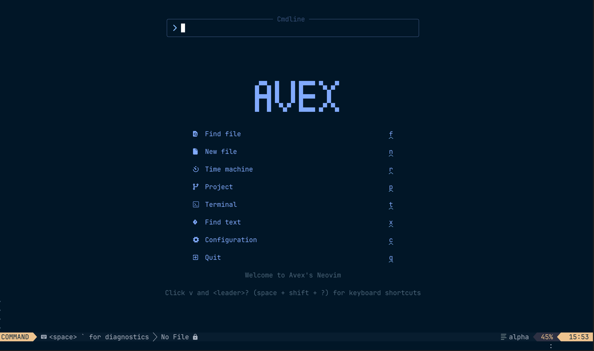

<h1 align="center">Avex Neovim</h1>


<br>
Avex Neovim is a lightweight and high performance configuration built from scratch.
It is designed for developers who want a clean, distraction-free environment while maintaining powerful features.


## Key-features
1. <b>Avex dashboard</b> <br>
A custom screen using alpha-nvim with a "Avex" ASCII logo with shortcuts.
2. <b>Nightfly colorscheme</b> <br>
Cool theme for professional use, optimized for long coding sessions.
3. <b>Custom statusline</b> <br>
Modern, informative bottom bar with added shortcut to display diagnostics.
4. <b>Your favourite shortcuts</b> <br>
Available visual shortcut hints made neovim easier.
5. <b>Integrated terminal</b> <br>
Built for fast, and efficient terminal accessible with a single keystroke. Perfect for managing scripts, and viewing outputs.


## Requirements
1. <b>Nerd Font</b> <br>
A [nerd font](https://www.nerdfonts.com/font-downloads) is required to install so that it renders the custom icons in the dashboard, file explorer, and status line. Without it, icons will appear as broken boxes or question marks.
Recommended: JetBrainsMono Nerd Font

2. <b>Terminal emulator</b> <br>
This neovim config is optimized for [ghostty](https://ghostty.org) fast rendering and native image support. It is GPU-accelerated and smooth UI performance.

NOTE: Mason is used to install and manage LSP servers, DAP servers, linters, and formatters via the `:Mason` command.

<br>

## Installation Method 1
1. Clone the repository <br>
Clone avex-nvim into your standard Neovim config directory:
```bash
git clone https://github.com/avexcz/avex-nvim.git ~/.config/nvim
cd ~/.config/nvim
```


2. Install Plugins <br>
Open Neovim (`nvim`). You may see some initial errors and this is normal as plugins aren't installed yet. Run the following command:
```vim
:PackerSync
```
Note: You may need to restart Neovim after the sync finishes for all UI elements to load correctly.
If packer fails, then install Packer manager so that neovim notice the plugin-setup:  <br> 
`git clone --depth 1 https://github.com/wbthomason/packer.nvim \
 ~/.local/share/nvim/site/pack/packer/start/packer.nvim`


### Get Healthy
open neovim via `nvim` on terminal and enter the following:
```vim
:checkhealth
```
It is normal to have warnings. I'll update them, don't worry about and stay in touch!

<br>

## Installation Method 2 (Shortcut)
1. Install Docker <br>
Install docker via [docker.com](docker.com/products/docker-desktop) and sign-up.
 
2. Run Avex <br>
Once Docker is running, you need to login via `docker login` on your CLI and you don't need to clone this repo or install plugins manually. Simply run the following command in your terminal:
```bash
docker run -it --rm devXam5/avex-nvim

```

3. Copy configuration to local machine (Recommended)
```bash
docker run --rm -v ~/.config/nvim:/install_destination devxam5/avex-nvim \
sh -c "cp -rv /root/.config/nvim/. /install_destination"
```

WARNING: Add a "Backup" Warning

🛑 WARNING: Running the install command will overwrite your existing Neovim configuration. If you have an existing config, back it up first:
    ```bash
    mv ~/.config/nvim ~/.config/nvim_backup
    ```

Note: Alpine linux's neovim is capped to 0.11.7 version which can cause tree-sitter an error after running `:checkhealth`. It is best to copy this configuration to your local machine with your latest neovim (0.12.0)

 ## Install Neovim
 ### MacOS:
    ```bash
    brew upgrade neovim
    ```

 ### Windows:
    ```bash
    winget upgrade Neovim.Neovim
    ```

 ### Linux:

  Ubuntu/Debian:
    ```bash
    sudo apt update
    sudo apt upgrade neovim
    ```


  Arch:
    ```bash
        sudo pacman -Syu neovim
    ```

  Fedora:
    ```
    sudo dnf upgrade neovim
    ```


   If it fails, try manual installation from [official neovim](https://github.com/neovim/neovim)

## Recommended Version
Neovim >= 0.11 is recommended for modern configurations.
